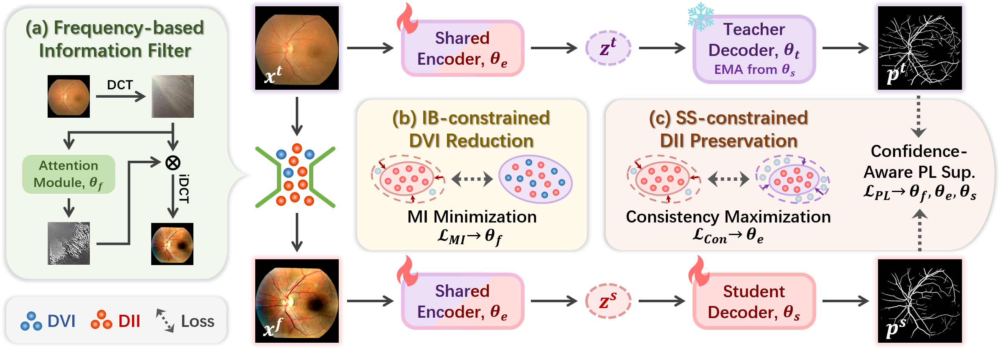

# AIF-SFDA: Autonomous Information Filter-driven Source-Free Domain Adaptation for Medical Image Segmentation

This repository contains the official implementation of [AIF-SFDA: Autonomous Information Filter-driven Source-Free Domain Adaptation for Medical Image Segmentation](). This work has been accepted by AAAI 2025.



## Datasets

In the fundus vessel segmentation task, the training set DRIVE is available at [DRIVE](https://drive.grand-challenge.org/).
The test set AVRDB is available at [AVRDB](https://data.mendeley.com/datasets/3csr652p9y/1).
The test set CHASEDB1 is available at [CHASEDB1](https://blogs.kingston.ac.uk/retinal/chasedb1/).
The test set DRHAGIS is available at [DRHAGIS](https://pubmed.ncbi.nlm.nih.gov/28217714/).
The test set LESAV is available at [LESAV](https://figshare.com/articles/dataset/LES-AV_dataset/11857698/1).
The test set STARE is available at [STARE](http://cecas.clemson.edu/~ahoover/stare/).

The data used for the orthopedic ultrasound image segmentation task is sourced from private data obtained through collaboration with our cooperated hospital. Due to copyright restrictions, we are unable to disclose this data publicly.
All of the above datasets should be organized in the following structure:

```
<root_name>
- 0
    - image.png
    - label.png
    - mask.png
- 1
- 2
...
```

## Dependencies

* torch>=0.4.1
* torchvision>=0.2.1
* dominate>=2.3.1
* visdom>=0.1.8.3

## Training

Before running the training code, you need to start the visdom server by running the following command:

```
python -m visdom.server -p <some free port> --host 0.0.0.0
```

The training command in the pretrain phase is as follows:

```
python procedures/train.py --data_dirname <path to your dataset> --model_name pretrain_unet --input_nc 3 --output_nc <class number> --dataset_name naive --batch_size 2 --preprocess vertical_flip horizontal_flip rotate --drop_last --optimizer adam --lr_scheduler linear --epochs_num <epoch number> --decay_epochs_num <you can set it to half the epoch number> --save_epoch_freq 2 --norm_layer InstanceNorm2d --name pretrain_unet --display_port 19191 --gpu_ids 0
```

The training command in the adaptation phase is as follows:

```
python procedures/train.py --data_dirname <path to your dataset> --model_name FIB_unet --input_nc 3 --output_nc <class number> --dataset_name naive --batch_size 2 --preprocess vertical_flip horizontal_flip rotate --drop_last --optimizer adam --lr_scheduler linear --epochs_num <epoch number> --decay_epochs_num <you can set it to half the epoch number> --save_epoch_freq 2 --segmentation_pretrain_path <path to the best pth file in the pretrain phase> --name AIF_SFDA --display_port 19191 --gpu_ids 0 --do_filter_smooth --label_threshold 0.8 --ema_smooth_factor 0.9995 --alpha_0 1 --alpha_1 0.5 --alpha_2 1 --alpha_3 1
```

## Acknowledgment
This work was supported in part by the Basic Research Fund in Shenzhen Natural Science Foundation (Grant No. JCYJ20240813095112017), National Natural Science Foundation of China (Grant No. 62401246, 82272086), National Key R&D Program of China (Grant No. 2024YFE0198100), and Shenzhen Medical Research Fund (Grant No.D2402014).

## Citation

If you find our works useful for your research, please cite our paper:

```
@inproceedings{li2025aif,
  title={AIF-SFDA: Autonomous Information Filter-driven Source-Free Domain Adaptation for Medical Image Segmentation},
  author={Li, Haojin and Li, Heng and Chen, Jianyu and Zhong, Rihan and Niu, Ke and Fu, Huazhu and Liu, Jiang},
  booktitle={39th AAAI Conference on Artificial Intelligence},
  year={2025},
  organization={AAAI}
}
```


